# LabArt

A small laboratory of visual-creation skills, packaged as a Claude / Codex
plugin marketplace. Each plugin is a self-contained aesthetic system.

| Plugin | Medium | What it makes |
| --- | --- | --- |
| [Antibes Holiday](#antibes-holiday) | black pen | relaxed line illustrations, story scenes, logo marks |
| [Dirty Pixels](#dirty-pixels) | pixel particles | flowing particle redraws of images, seamless loops |

```
/plugin marketplace add haorantang97/LabArt
```

---

# Antibes Holiday

Antibes Holiday is a portable visual-creation skill for original relaxed
black-pen illustrations, narrative scenes, expressive marks, and early logo
exploration.

It focuses on physical stroke behavior, shorthand recognition, confident
incompletion, causal story staging, active blank space, and non-equilibrium
proportion. It is a general visual grammar, not an identity-bound imitation
package.

## Examples

These original outputs show the range of the system. They are release examples,
not runtime style references.

<table>
  <tr>
    <td width="50%">
      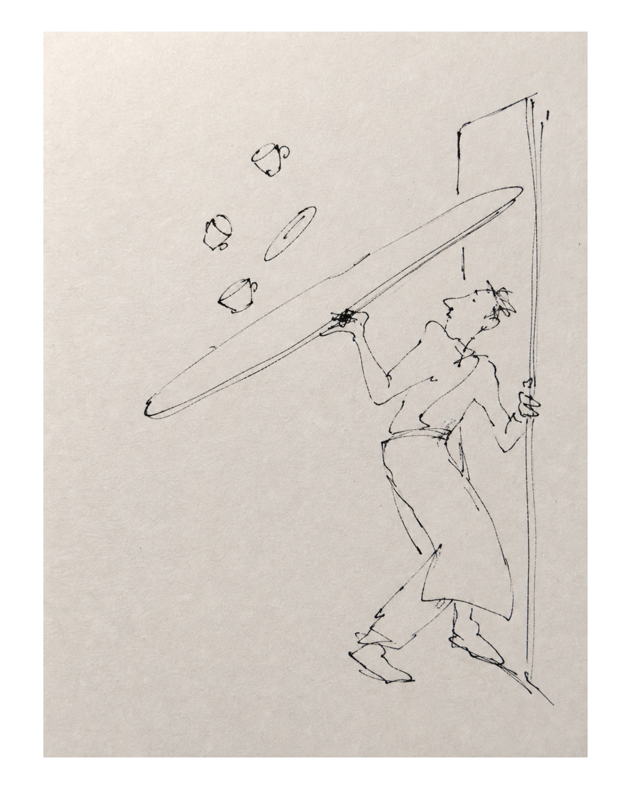
      <br><strong>Precarious timing</strong><br>
      A tilted tray and airborne cups turn bodily counterforce into the event.
    </td>
    <td width="50%">
      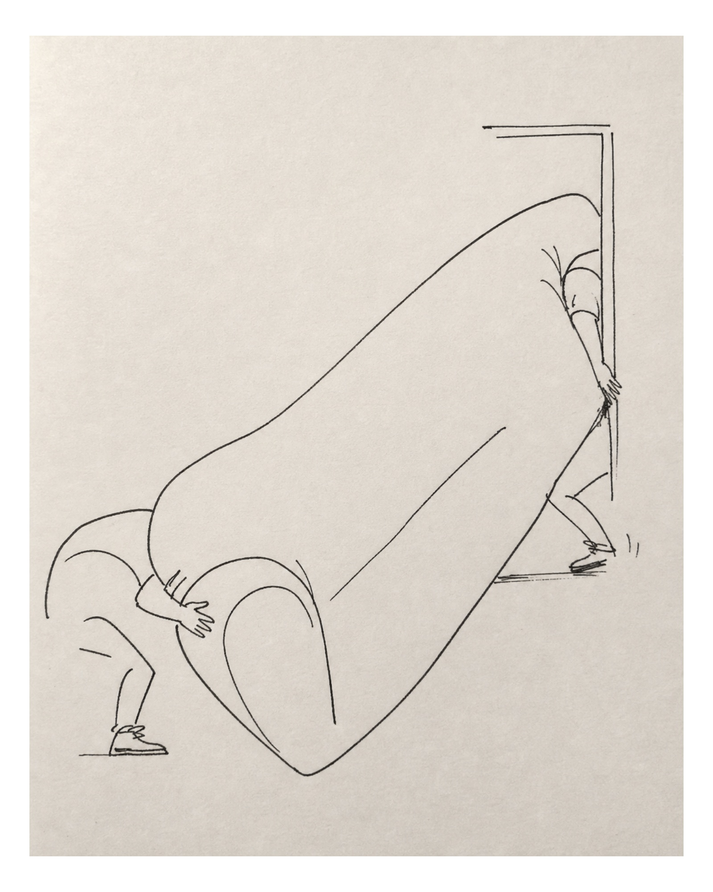
      <br><strong>Dominant mass</strong><br>
      Scale distortion turns an ordinary action into the scene's visual cause.
    </td>
  </tr>
  <tr>
    <td width="50%">
      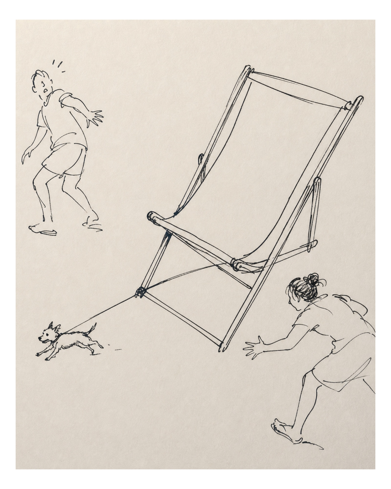
      <br><strong>Multi-actor causality</strong><br>
      Unequal detail and scale keep a complex event readable.
    </td>
    <td width="50%">
      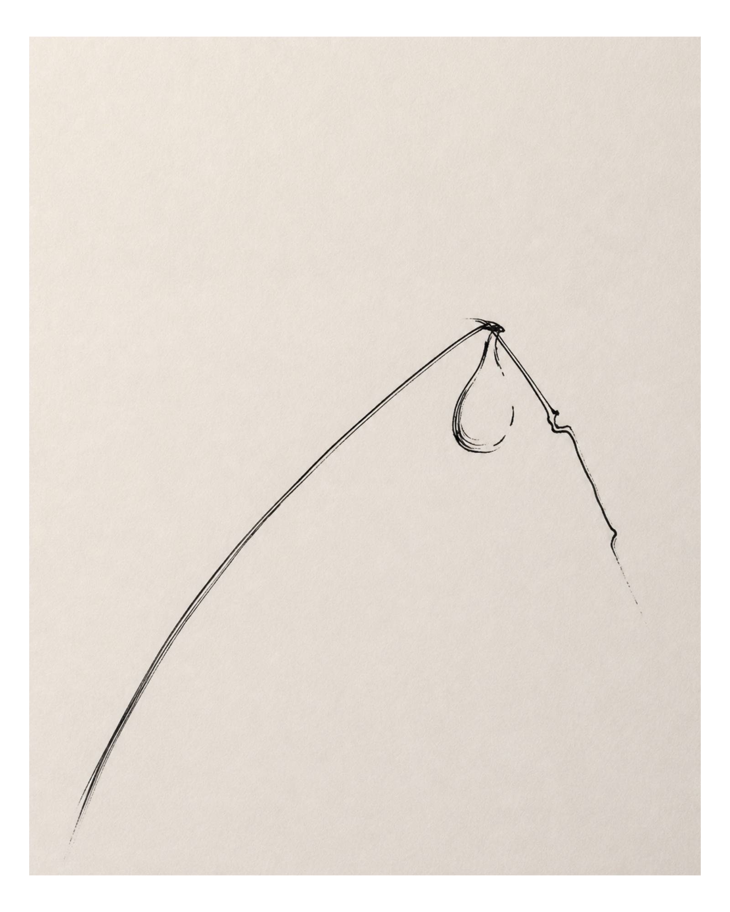
      <br><strong>Abstract relationship</strong><br>
      One long tension line and a compact recognition knot carry the idea.
    </td>
  </tr>
  <tr>
    <td width="50%">
      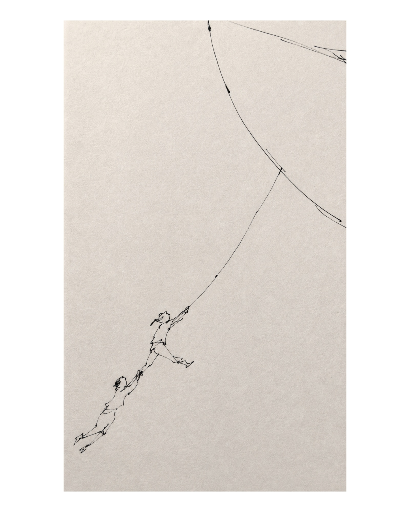
      <br><strong>Active blank space</strong><br>
      Distance and force are staged through a single causal sweep.
    </td>
    <td width="50%">
      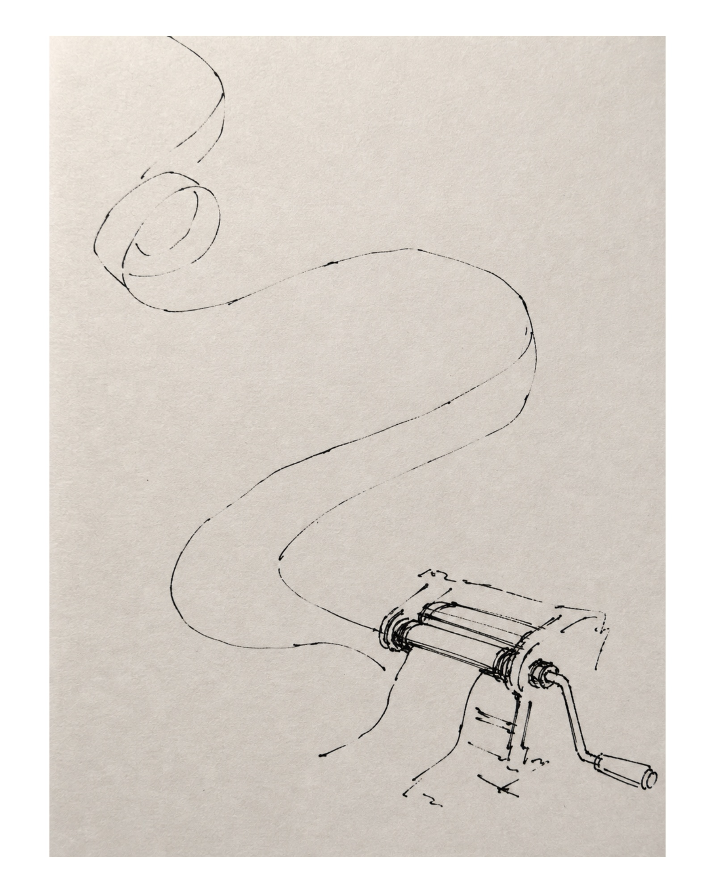
      <br><strong>Operational shorthand</strong><br>
      The mechanism is abbreviated while its material path is exaggerated.
    </td>
  </tr>
  <tr>
    <td colspan="2" align="center">
      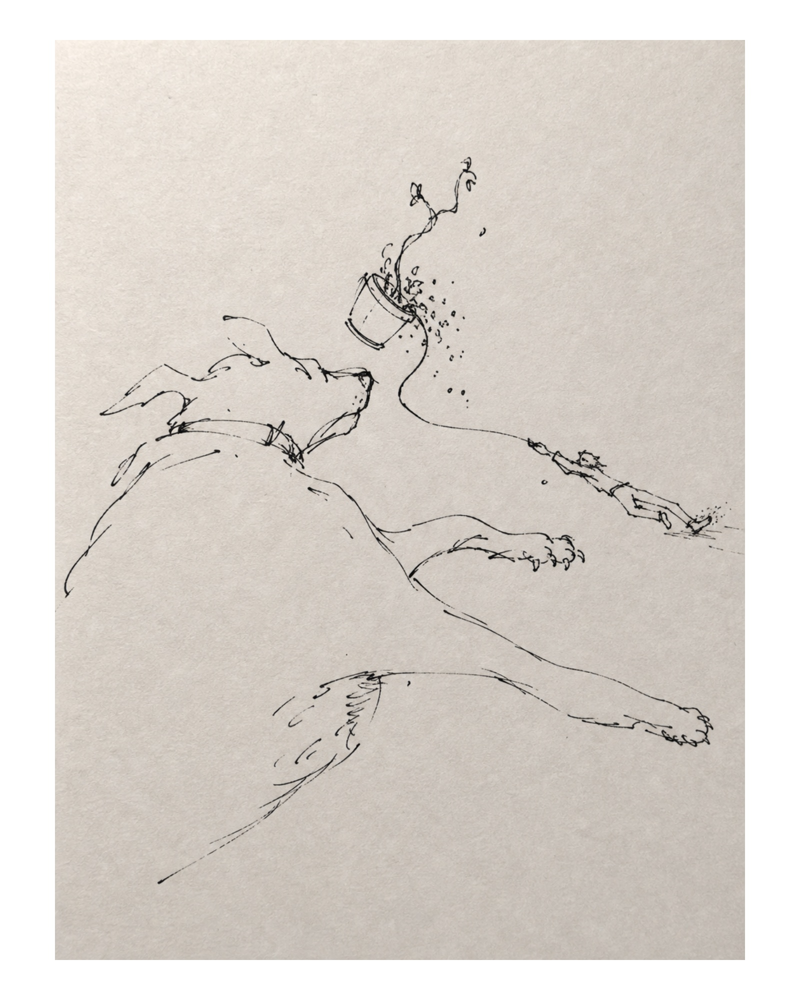
      <br><strong>Mixed line density</strong><br>
      Sparse story marks coexist with a rougher, more physical focal mass.
    </td>
  </tr>
</table>

## What Is Included

- `plugins/antibes-holiday/.codex-plugin/plugin.json`: Codex plugin metadata.
- `plugins/antibes-holiday/skills/antibes-holiday/SKILL.md`: execution workflow.
- `references/style-system.md`: detailed drawing and composition system.
- `references/prompt-recipes.md`: renderer-neutral prompt scaffolds.
- `assets/stroke-calibration.png`: original non-semantic stroke calibration asset.
- `plugins/antibes-holiday/assets/examples/`: seven selected original public outputs.

Third-party screenshots, source identities, copied compositions, and private local
paths are not included.

## Install As An Agent Skill

With GitHub CLI 2.90 or newer:

```bash
gh skill install haorantang97/antibes-holiday antibes-holiday
```

With the open `skills` installer:

```bash
npx skills add haorantang97/antibes-holiday --skill antibes-holiday
```

## Install In Codex

Add this repository as a marketplace, then install the plugin:

```bash
codex plugin marketplace add haorantang97/antibes-holiday
codex plugin add antibes-holiday@antibes-holiday
```

Start a new Codex task after installation so the new skill is loaded.

For a local checkout:

```bash
codex plugin marketplace add /absolute/path/to/antibes-holiday
codex plugin add antibes-holiday@antibes-holiday
```

## Compatibility

| Environment | Behavior |
| --- | --- |
| Codex with built-in image generation | Full generation and editing workflow |
| Another agent with a raster image tool | Uses that platform's native renderer |
| Agent without local-image attachment support | Uses the textual stroke specification |
| Agent without image generation | Produces a renderer-ready prompt and validation checklist |

`references/*.md` files are supporting instructions, not standalone skills. The
main `SKILL.md` links to them explicitly so a compatible skill loader can read
them when required. Preserve the complete directory structure.

`agents/openai.yaml` supplies Codex UI metadata. Other agents may safely ignore it.
Claude Desktop does not automatically discover Codex plugins from disk and needs
its own project, connector, or instruction-loading setup.

## Example Requests

- Use Antibes Holiday to draw two people struggling with an oversized object.
- Turn this product mechanism into a sparse black-pen editorial illustration.
- Explore an expressive display mark from this brand concept.
- Analyze these references for line behavior without copying their subjects.

## Rendering Dependency

The plugin does not bundle or install an image model. In Codex it prefers the
system image-generation workflow. On other platforms it selects an available
native renderer. Without a renderer it degrades honestly to prompts and review
criteria instead of claiming an image was created.

## Originality

Do not market outputs as the work or official style of a third party. Do not
trace source images, reuse signature characters, or preserve source compositions.
References are evidence for general line and composition mechanisms only.

## License

The plugin instructions and bundled original calibration asset are distributed
under the PolyForm Noncommercial License 1.0.0. See `LICENSE`.

## Validation

The release is checked with the Codex Skill and Plugin validators, a clean archive
extraction test, a real local Marketplace installation, and reference-free forward
tests. See [`docs/VALIDATION.md`](docs/VALIDATION.md).

---

# Dirty Pixels

Dirty Pixels is a deterministic renderer that redraws any image as flowing
pixel-particle art on pure black. Strokes follow the image's own structural
direction field and really travel along it; short specks carry the image while
long, frayed streaks carry the motion. Regional motion is planned from the
picture's physics (light falls, embers rise, wave barrels rotate), and every
animation loops seamlessly. Outputs PNG, GIF and MP4.

## Examples

<table>
  <tr>
    <td width="50%">
      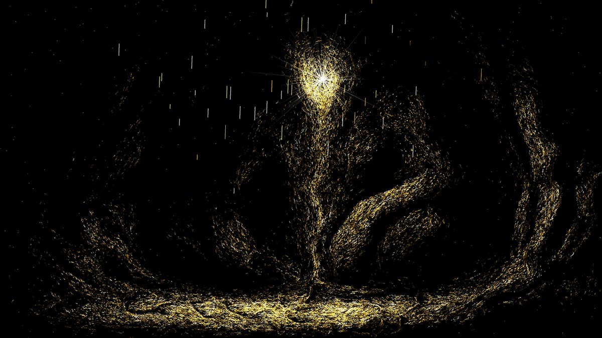
      <br><strong>Single light source</strong><br>
      The eye is the burst focus; dust streams away from it and the pillar falls.
    </td>
    <td width="50%">
      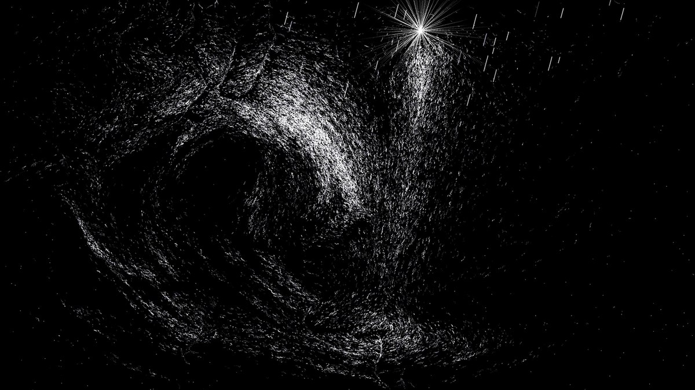
      <br><strong>Physics-planned motion</strong><br>
      The shaft falls, the back of the wave climbs, the barrel rotates.
    </td>
  </tr>
  <tr>
    <td width="50%">
      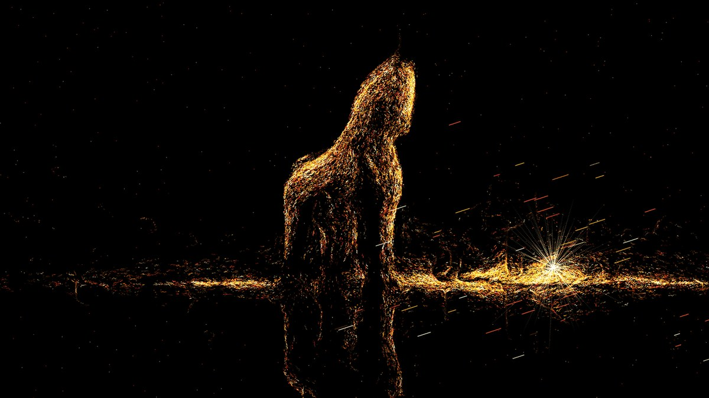
      <br><strong>Structure-following strokes</strong><br>
      Every plank reads because strokes lie along the image's own edges.
    </td>
    <td width="50%">
      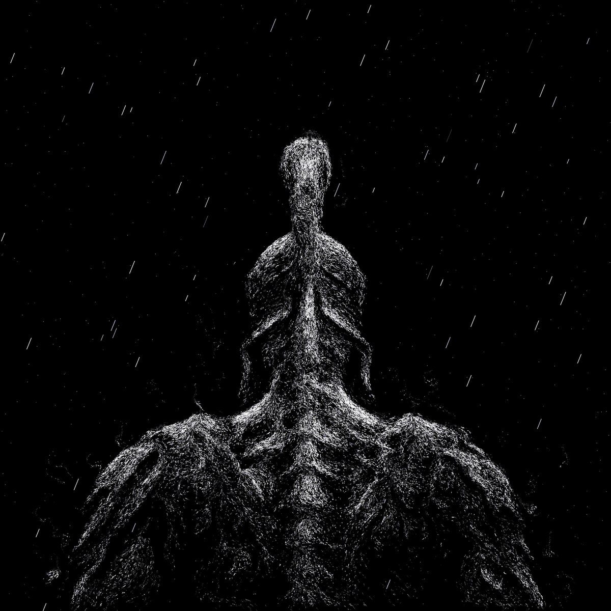
      <br><strong>Long/short stroke mix</strong><br>
      Specks carry the form; frayed streaks carry the energy.
    </td>
  </tr>
</table>

Animated example: <code>plugins/dirty-pixels/assets/examples/trojan-horse-loop.gif</code>
(seamless loop; GitHub renders it inline on the file page).

